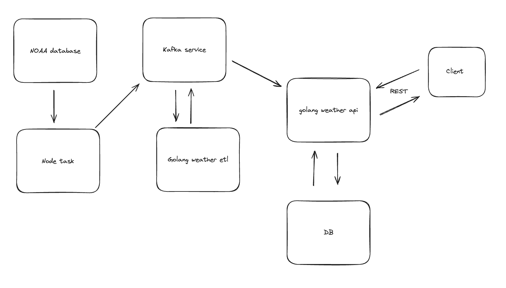

# NOAA Data Collector

This system uses three services:
- data collector from NOAA database written in NodeJS and Typescript that pushes it to Kafka topic "raw-weather-reports"
- data etl processor written in Golang that consume Kafka messages from topic "raw-weather-reports", standardizes it, and pushes it to "transformed-weather-data"
- database injector and REST API service written in Golang.



## Setup
Docker is needed for this env setup. 

Services that need to be run.
- kakfa
- postgres

Commands to set up Kafka
```
docker run -d -p 9092:9092 --name broker apache/kafka:latest
```

Commands to setup Mysql DB
```
docker run --name mysql -d \
    -p 3306:3306 \
    -e MYSQL_ROOT_PASSWORD=change-me \
    --restart unless-stopped \
    mysql:8
```

The database `storms` needs to be created and the following tables are needed.
- hail_events
- tornado_events
- wind_events

You can find the database schema for each table in the database folder. In future iterations,
the database schemas changes would be maintained in their own repo. 

## Run the services

First, the data node project needs to be start. 
```
cd data
npm start
```

Then the etl go project
```
cd etl
go mod tidy
go run cmd/main.go
```

Last the api go project
```
cd api
go mod tidy
go run cmd/main.go
```